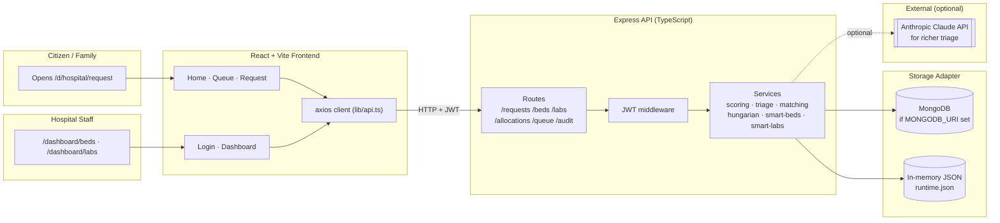
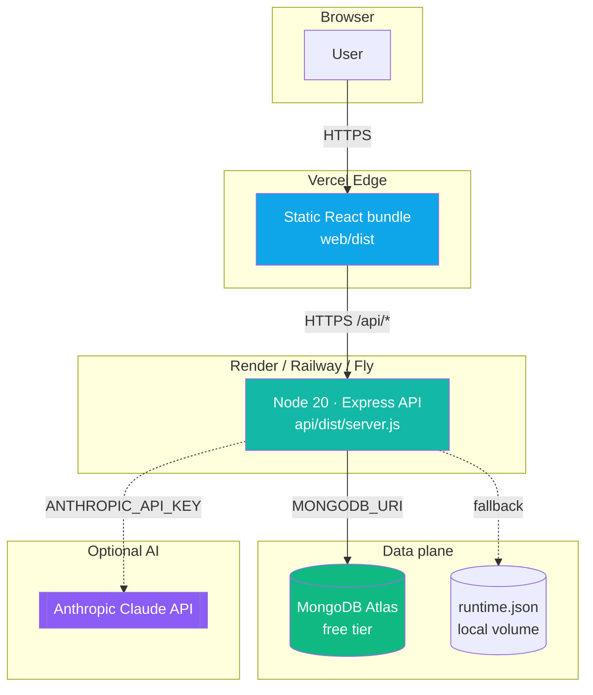
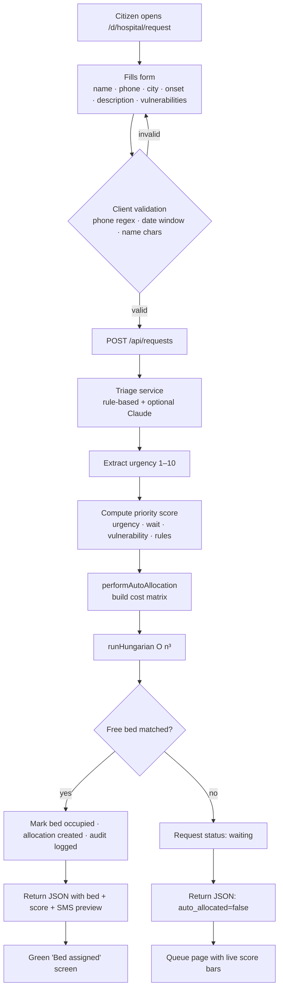
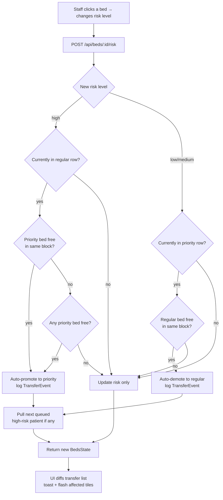

# Smart Bed Allocation

**A hospital admission engine that matches patients to beds — automatically, fairly, and with a full audit trail.**

> Priority-aware. Hungarian-backed. Real-time. Zero manual allocation clicks.

Built for **Hackathon Aethronix** · single-hospital deployment · production-grade architecture in a demo-friendly footprint.

---

## The problem

Hospital admission in most Indian public hospitals today looks like this:

- A family member calls or walks in with a crisis.
- A clerk checks a whiteboard, phones the ward, asks the doctor on duty.
- 30–45 minutes of back-and-forth decides which bed the patient gets.
- Critical patients routinely wait behind routine cases because **nobody has a live, prioritised picture** of the queue and the beds at the same time.
- When a patient deteriorates inside the ward, the bed shuffle is manual, slow, and often forgotten in the paper log.

The cost is measured in minutes — and in lives.

---

## Our solution

A single web app with two faces:

1. **Public intake** — a citizen describes the emergency in plain words. The system scores priority on a transparent formula, runs the **Hungarian algorithm** over every waiting patient × every free bed, and returns a bed number before the form animation finishes.
2. **Staff dashboard** — a live, glanceable view of all 48 beds and 30 labs. When a patient's condition changes, the system reshuffles beds automatically and flashes every move on screen. Every decision is logged with a timestamp, actor, and reason.

No "Run Hungarian" button. No manual triage spreadsheet. No hidden black box. The math is transparent, the UI is glanceable, and the audit trail is complete.

---

## What makes it different

| Most solutions | This system |
|---|---|
| First-come-first-served queues | Hungarian optimal matching across the full bipartite graph |
| Scores hidden inside the ML model | 4-component formula rendered as coloured bars on every row |
| Manual bed shuffles when patients deteriorate | Auto-promotion, auto-demotion, auto-bump — all state-driven |
| Audit log is an afterthought | Every admit / bump / promote / demote / discharge / lab preempt logged with reason |
| "Paste your OpenAI key to run" | Works fully offline on a rule-based triage fallback |
| Requires Postgres + Redis + Docker to demo | Single `npm run dev` on each side. Zero infra. |

---

## Core capabilities

### 1. Transparent priority scoring

```
score = urgency × 40 + wait × 20 + vulnerability × 20 + clinical rules × 20
```

The four components are rendered as coloured bars next to every queue row. A citizen can read *why* they got the score they got. A judge can defend the formula on stage. See [`docs/scoring.md`](docs/scoring.md).

### 2. Implicit Hungarian matching

Every `POST /api/requests` runs `performAutoAllocation()` which invokes the **Jonker–Volgenant O(n³)** Hungarian solver over the entire open queue × free beds in one pass. This guarantees the globally-optimal assignment — a critical patient can never be starved of an ICU because a routine case arrived seconds earlier.

### 3. Smart reallocation (state-driven)

| Trigger | Action |
|---|---|
| High-risk arrival, priority bed free | Admit to priority |
| High-risk arrival, priority full | **Bump** lowest-risk priority occupant to regular → admit incoming to freed slot |
| Patient risk escalates in a regular bed | Auto-promote to priority if free |
| Patient risk drops in a priority bed | Auto-demote to regular, freeing the slot for the queue |
| Discharge | Pull next queued patient into the freed bed |

### 4. Lab lifecycle with emergency preemption

Labs have 3 states (available / in-use / maintenance) and a separate **emergency** flag. An in-use lab with emergency ON preempts the running test into the queue when a STAT test arrives.

### 5. Real-time visual feedback

Every transfer the backend emits carries a `resource_ids` array. The UI diffs events between polls and:
- Fires a **toast notification** for every new move.
- **Flashes the affected tiles** with a teal ring animation.

Invisible algorithmic decisions become visible UI moments — critical for staff trust and for jury demos.

### 6. Full audit trail

`GET /api/audit` returns the last 100 events. Every admit, bump, promote, demote, discharge, lab assign, emergency toggle, maintenance flip is stamped with `timestamp · actor · payload`. Medico-legal by default.

---

## System architecture



---

## Infrastructure / deployment topology



The stack runs in three tiers:

| Tier | Component | Host | Notes |
|---|---|---|---|
| Edge | Static React bundle (Vite) | Vercel / Netlify | Zero-config Vite build |
| App | Express API (TypeScript) | Render / Railway / Fly | Single stateless process |
| Data | MongoDB Atlas **or** in-memory JSON | Atlas free tier / local disk | Storage adapter hides the difference |

For the demo we run everything locally: `npm run dev` on each side, no Docker, no external DB.

---

## Patient-intake flowchart



---

## Smart reallocation flowchart



---

## Quickstart — 2 minutes

Prerequisites: **Node.js 20+**. Nothing else.

```bash
# 1. API
cd api && npm install
cp ../.env.example ../.env   # optional — defaults work
npm run dev                  # → http://localhost:4000

# 2. Web (in a new terminal)
cd web && npm install
npm run dev                  # → http://localhost:5173
```

Open **http://localhost:5173/**.

### Staff login

```
Username: admin
Password: hackathon2026
```

Override via `.env`:

```
ADMIN_USERNAME=...
ADMIN_PASSWORD=...
JWT_SECRET=long-random-string
WEB_ORIGIN=http://localhost:5173
```

### No MongoDB? No problem.

Leave `MONGODB_URI` blank. The API uses an in-memory JSON store (`api/data/runtime.json`). Delete that file to re-seed.

### No Claude API key? Also fine.

Triage falls back to a rule-based parser (regex + Indian-language keywords like `saans`). Set `ANTHROPIC_API_KEY` in `.env` to use Claude for richer extraction.

---

## Tech stack

| Layer | Technology | Why |
|---|---|---|
| Frontend | React 18 · Vite · TypeScript · Tailwind · Lucide · react-router v6 | Fast dev loop, modern stack, glanceable UI |
| Backend | Node 20 · Express · TypeScript · tsx watch · Zod | Simple, stateless, type-safe boundary validation |
| Storage | MongoDB (optional) · In-memory JSON | Zero infra for demo, cloud-ready for production |
| Auth | JWT (12h expiry) | Stateless, standard, production-ready |
| Algorithms | Jonker–Volgenant Hungarian O(n³) — pure TypeScript | Zero external deps, auditable math |
| Optional AI | Anthropic Claude (triage layer) | Graceful fallback to rule-based parser |

---

## Repository layout

```
aethronix/
├── api/                           Express API (TypeScript)
│   ├── src/
│   │   ├── data/                  Seeds (blocks + pre-occupied beds + labs)
│   │   ├── services/              Pure logic — scoring, triage, hungarian, smart-beds, smart-labs
│   │   ├── routes/                Thin HTTP shells
│   │   ├── middleware/auth.ts     JWT middleware
│   │   ├── store.ts               Storage adapter (Mongo | in-memory)
│   │   ├── types.ts               Zod schemas + TS types
│   │   └── server.ts              Express wiring + auto-seed
│   └── test/e2e.mjs               53-test integration suite (zero deps)
│
├── web/                           React + Vite frontend
│   └── src/
│       ├── pages/                 Home · Login · Request · Queue · Dashboard
│       ├── components/            Layout · Toaster · Modal · ScoreBars · dashboard/*
│       └── lib/                   api client · auth · validators · i18n · toast pub-sub
│
├── docs/
│   ├── architecture.md            Deep dive — engine, layers, data flow
│   ├── flowcharts.md              End-to-end flowcharts for every key path
│   ├── api.md                     Full REST endpoint reference
│   ├── scoring.md                 Priority formula + worked examples
│   ├── demo-guide.md              3-minute jury demo script
│   └── setup.md                   Dev + deployment setup
│
├── CLAUDE.md                      AI-assistant guidance for this repo
└── README.md                      You are here
```

---

## Running tests

```bash
cd api
npm run test:e2e
```

**53 integration tests, all passing** — auth, Hungarian, bed admission rules, bump logic, risk changes, lab lifecycle, input validation, and endpoint removal.

---

## Deployment

| Target | How |
|---|---|
| Web → Vercel | Root: `web/` · Build: `npm run build` · Output: `dist/`. Set `VITE_API_URL` to the deployed API URL. |
| API → Render / Railway / Fly | Build: `cd api && npm install` · Start: `cd api && npm start`. Set env: `WEB_ORIGIN`, `JWT_SECRET`, `ADMIN_USERNAME`, `ADMIN_PASSWORD`. |
| DB → MongoDB Atlas | Free tier. Paste connection string into `MONGODB_URI`. Leave blank to stay in-memory. |

See [`docs/setup.md`](docs/setup.md) for details.

---

## Documentation index

| Document | For |
|---|---|
| [`docs/architecture.md`](docs/architecture.md) | Deep dive — the engine, the three layers of intelligence, data flow diagrams |
| [`docs/flowcharts.md`](docs/flowcharts.md) | Every key path as a mermaid flowchart — intake, risk change, bump, lab preemption |
| [`docs/api.md`](docs/api.md) | Full REST endpoint reference with shapes |
| [`docs/scoring.md`](docs/scoring.md) | Priority formula with four worked examples |
| [`docs/demo-guide.md`](docs/demo-guide.md) | 3-minute jury demo script with fallback paths |
| [`docs/setup.md`](docs/setup.md) | Install · configure · deploy |

---

## Design principles

1. **Simplicity is the feature. Complexity is a bug.** A hospital triage coordinator should understand this tool in under 60 seconds.
2. **Nothing hidden.** Every score is visible. Every move is logged. No black-box decisions.
3. **Graceful degradation.** MongoDB optional. Claude API optional. Zero-infra demo path always works.
4. **State-driven, not form-driven.** The system responds to risk changes and arrivals — the staff never clicks "reallocate".

---

## The pitch in one sentence

> A hospital admission engine that reads patient descriptions, scores priority transparently, runs the Hungarian algorithm automatically, reshuffles beds when conditions change, and logs every move — all with a UI a tired intern can use at 3 AM.

**Urgent first. Auto-reallocates. Fully audited.**
