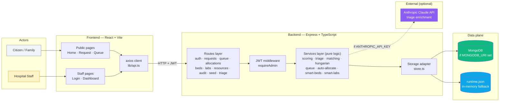
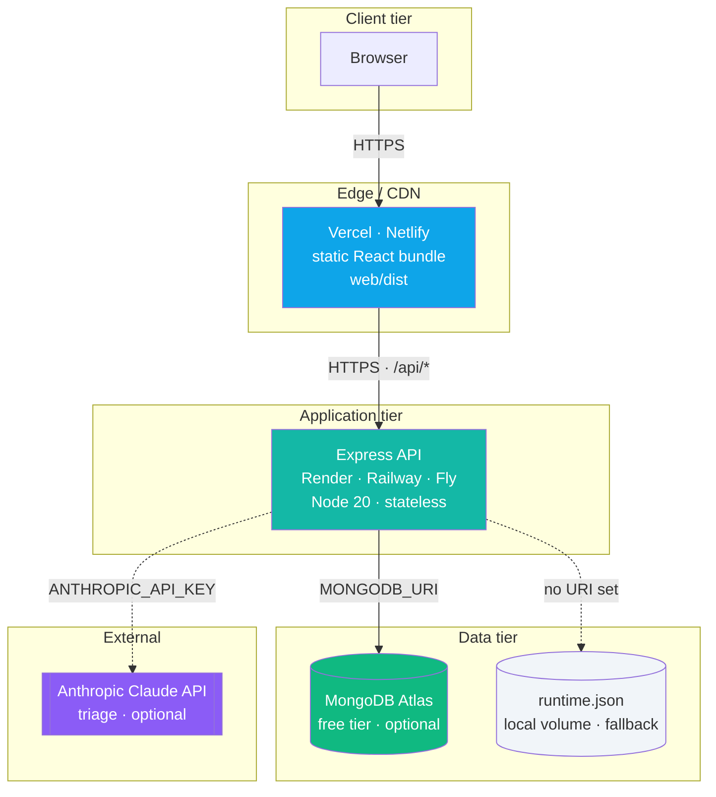
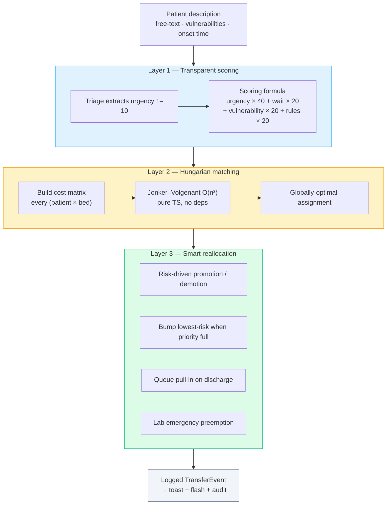
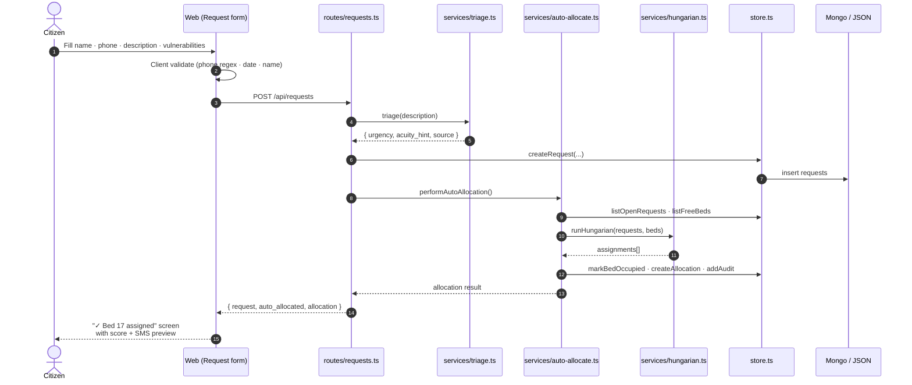
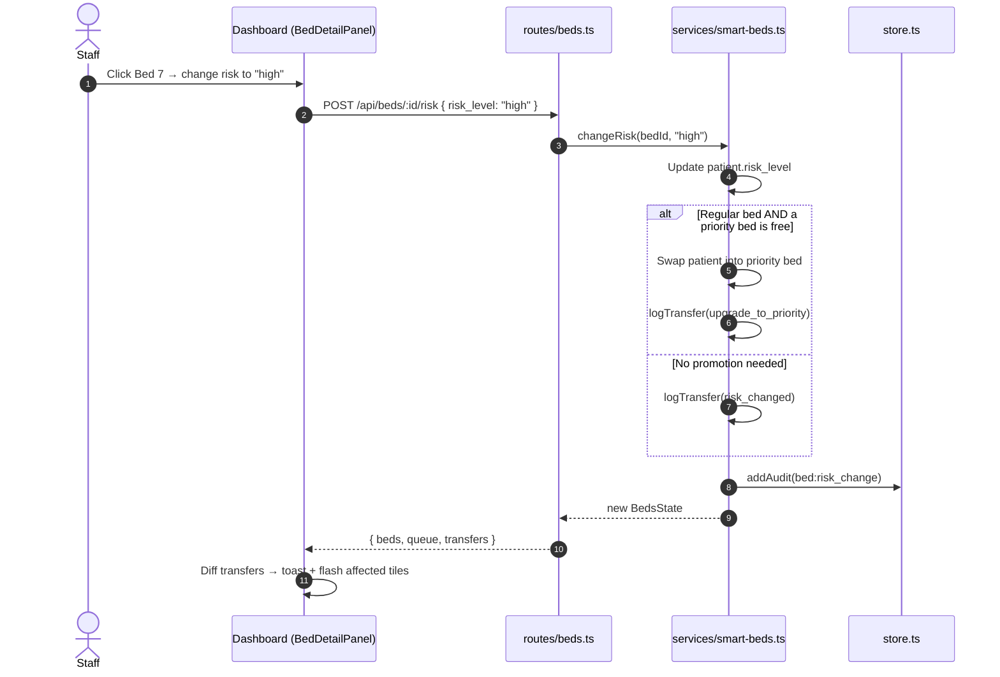

# Architecture

How the Smart Bed Allocation system is put together — end-to-end.

---

## Executive summary

A React frontend talks to an Express API. The API scores priority transparently, runs the **Hungarian algorithm** automatically on every new patient request, and layers smart reallocation rules (bump · promote · demote · queue pull-in) over a live bed and lab dashboard. Every state transition emits a `TransferEvent` that the frontend renders as a toast + flash animation. Every mutation is logged to an audit trail.

---

## System architecture (logical)



---

## Infrastructure / deployment topology



Three loosely-coupled tiers. Each can be swapped or scaled independently. For the hackathon demo, all three run locally with zero infra cost.

---

## Three layers of intelligence



### Layer 1 — Transparent priority scoring

Every request is scored with a **public formula**:

```
score = urgency × 40 + wait × 20 + vulnerability × 20 + clinical rules × 20
```

Implemented in `api/src/services/scoring.ts`. See [`docs/scoring.md`](scoring.md) for worked examples.

**Key property: nothing is hidden.** The four factors are rendered as coloured bars on every queue row, so a citizen can read *why* they got the score they got.

### Layer 2 — Hungarian matching (automatic)

The priority score feeds into a **cost matrix**. The Hungarian algorithm (Jonker–Volgenant variant in `hungarian.ts`, O(n³)) solves the min-cost bipartite matching across **all open requests × all free beds** in one pass.

This runs **automatically** on every `POST /api/requests`. There is no "Run Hungarian" button. The shared entry point is `performAutoAllocation()` in `services/auto-allocate.ts`.

**Why Hungarian and not a simple sort?** A naive first-come-first-served pass can starve a critical patient of an ICU when a lower-priority case arrived seconds earlier. Hungarian considers every (patient, bed) pair simultaneously and returns the globally-optimal set.

### Layer 3 — Smart reallocation rules

Once beds have patients, the system maintains an invariant: *high-risk patients live in priority rows, lower-risk patients in regular rows*. These rules in `services/smart-beds.ts` enforce it:

| Trigger | Action |
|---|---|
| High-risk admit, priority bed free | Admit to priority row |
| High-risk admit, priority full, lower-risk occupant exists | **Bump** that occupant to regular row → admit high-risk to freed priority slot |
| High-risk admit, no bump possible | Enqueue with reason logged |
| Low/medium admit | Admit to regular row (or queue if full) |
| Patient risk escalates to high in a regular bed | Auto-promote to priority if free |
| Patient risk drops from high in a priority bed | Auto-demote to regular if free |
| Discharge | Pull next queued patient into freed bed |

Every transition logs a `TransferEvent` (`kind`, `reason`, `resource_ids`) so:
- The right-side dashboard panel can render the transfer log.
- The UI can flash affected beds when state changes.
- The audit log has a full forensic trail.

---

## Bed block structure

4 blocks, 48 beds total, continuously numbered **1–48**.

| Block | Priority beds | Regular beds | Bed numbers |
|---|---|---|---|
| ICU Wing | 4 | 4 | 1–8 |
| General Ward | 4 | 16 | 9–28 |
| Pediatric Wing | 4 | 8 | 29–40 |
| Isolation Ward | 4 | 4 | 41–48 |

Block definitions in `api/src/data/dashboard-seed.ts` (`BED_BLOCKS`).

## Lab block structure

6 blocks, 30 labs total, continuously numbered **1–30**.

| Block | Labs | Numbers | Floor |
|---|---|---|---|
| Pathology | 5 | 1–5 | 1 |
| Microbiology | 5 | 6–10 | 1 |
| Biochemistry | 5 | 11–15 | 2 |
| Immunology | 5 | 16–20 | 2 |
| Radiology | 5 | 21–25 | 3 |
| Toxicology | 5 | 26–30 | 3 |

Room numbers follow `{floor}{position}` — e.g. Pathology Lab 3 is room `103`.

---

## Data flow — single patient request



---

## Data flow — staff changes patient risk



---

## Storage

`api/src/store.ts` exposes one interface with two implementations:

1. **MongoDB** if `MONGODB_URI` is set and reachable.
2. **In-memory JSON** (`api/data/runtime.json`) otherwise.

Routes and services never branch on which backend is active. They just call `upsertResource()`, `listRequests()`, etc.

### What lives where

- **Persistent (store-backed):** resources (beds + labs), requests, allocations, audit events.
- **In-memory module state:** the priority queue and transfer log for the beds/labs dashboards (module-level arrays in `smart-beds.ts` and `smart-labs.ts`). These reset on API restart. Deliberate — simpler demo, zero infra for ephemeral UI state.

---

## Authentication

- JWT token signed with `JWT_SECRET` (env), 12-hour expiry.
- Demo credentials in env: `ADMIN_USERNAME=admin`, `ADMIN_PASSWORD=hackathon2026`.
- `requireAdmin` middleware on all mutating routes (bed admit, risk change, lab toggles, seed reset).
- Client stores the token in `localStorage`. Axios interceptor adds `Authorization: Bearer <token>`.
- Public endpoints: `GET /api/health`, `GET /api/domains`, `GET /api/resources`, `POST /api/requests`, `GET /api/queue`, `GET /api/allocations`, `GET /api/audit`, `POST /api/triage`, `GET /api/beds`, `GET /api/labs`.

---

## Polling strategy

The UI doesn't use WebSockets — it polls:

- Public queue + home stats: every **5s**
- Staff dashboard: every **8s**

Simple, reliable, zero infra. At demo scale this is fine. For production, swap in Socket.IO with minimal changes — the DTO contracts are already stable.

---

## Real-time feedback loop

Every `TransferEvent` the backend emits carries a `resource_ids` array — the bed or lab IDs the move touched. The frontend diffs the transfer list between polls:

- **New transfers not seen before** → emit a toast (`lib/toast.ts` → `<Toaster />` in `App.tsx`).
- **Beds / labs in `resource_ids`** → flash with a teal ring animation (`flash-ring` CSS keyframe, ~1.1s pulse × 2).

This turns invisible algorithmic decisions into visible UI moments — critical for staff trust and for jury demos. The loop lives in `useTransferFeedback()` inside `pages/Dashboard.tsx`.

---

## Testing

`api/test/e2e.mjs` is a zero-dependency Node script (uses built-in `fetch`). It hits the running API and asserts:

- Auth flow (good + bad creds, protected routes 401)
- Hospital-only domain confinement
- Implicit Hungarian on `POST /api/requests`
- Removed endpoints return 404 (manual allocation, forecast)
- Bed block shape (48 beds, 4 blocks, continuous numbering)
- Smart admission rules (medium → regular, high → priority, high → bump)
- Risk change + discharge
- Lab assign / emergency preemption / maintenance block / reset
- API input validation

**53 tests, all passing.** Run with `cd api && npm run test:e2e`.

---

## What's intentionally minimal

- **No WebSockets** — polling every 5–8s is enough at hospital scale.
- **No distributed lock / transaction manager** — single-process API.
- **No microservices** — one Express process.
- **No forecast feature** — focus on the core allocation story.
- **Hospital domain only in the UI** — the `Domain` type still has 4 values but only `hospital` is seeded and wired.

---

## Extension points

See [`CLAUDE.md`](../CLAUDE.md) for step-by-step recipes:

- Add a new bed block
- Add a new lab block
- Change priority weights
- Add a new API endpoint
- Add a new smart-bed rule

---

## Related docs

- [`docs/flowcharts.md`](flowcharts.md) — every key path as a mermaid flowchart
- [`docs/api.md`](api.md) — full REST endpoint reference
- [`docs/scoring.md`](scoring.md) — priority formula with worked examples
- [`docs/demo-guide.md`](demo-guide.md) — 3-minute jury demo script
