# Demo Guide

A **3-minute live demo** of Smart Bed Allocation, designed for jury evaluation. Follow the three acts in order and the narrative lands every time: citizen intake → staff reallocation → lab preemption.

> **Tip:** rehearse once end-to-end before the jury slot. The `Reset` button in the dashboard header re-seeds the demo state in place — no restart needed.

---

## Before the demo starts

1. Start the API: `cd api && npm run dev`
2. Start the web: `cd web && npm run dev`
3. Open **two browser tabs**:
   - Tab 1: `http://localhost:5173/` (public view)
   - Tab 2: `http://localhost:5173/login` → sign in as `admin` / `hackathon2026` → lands on `/dashboard/beds` (staff view)
4. If you need a fresh state mid-demo: click the **Reset** button in the top-right of the dashboard (next to *+ Admit patient*). It wipes and re-seeds in place without restarting.

---

## The story you're telling

> Indian hospital admissions today take 30–45 minutes over phone calls and whiteboards, and emergencies often wait behind routine cases because nobody has a clear picture. This system reads the patient's situation in plain words, scores priority transparently, uses the Hungarian algorithm to match optimally, and automatically reshuffles beds when a high-risk patient arrives. Every decision is logged with a reason.

---

## Act 1 — The citizen side (45s)

**Tab 1 (public).** Start at `/`.

> "This is what a patient or family sees — a simple hero, a live count of free beds, and one big CTA."

Point to the live stats panel on the hero (Beds free, Waiting, Allocated, Utilization).

Click **"Request a bed →"**.

Fill in the form:
- Name: `Ramesh Yadav`
- Phone: `+91 9876543210`
- City: `Lucknow` (pre-filled)
- Onset time: leave as now
- Description: `Dada ji chest pain, sweating, BP 160/100, diabetic, sansne mein takleef`
- Tick **Senior citizen (60+)** in vulnerabilities

> "The phone is validated against an Indian mobile regex. The date is bounded. The description is triaged in the background."

Click **Submit**.

You should see a **green card**: *"✓ BED ASSIGNED · AUTOMATIC"* with a bed number (e.g. Bed 3), score (e.g. 78/100), and SMS preview.

> "Look at this. Nobody clicked 'allocate'. No doctor touched this form. The AI extracted urgency, added senior-citizen vulnerability, the Hungarian algorithm ran in the background, and assigned the globally-optimal bed. All in the time it took to press Submit."

Point at the SMS preview.

> "And this is the message the patient would receive — real SMS gateway ready, no-op in demo."

---

## Act 2 — The staff side (90s)

Switch to **Tab 2** (`/dashboard/beds`).

> "This is what the hospital admin sees. Four blocks — ICU, General, Pediatric, Isolation. 48 beds, numbered continuously. Every block has a **priority row** (red outline) and a **regular row** (teal)."

Point at the sidebar: **Beds · Labs · Intake queue · Public home**.

Point at the stats in the header: total / occupied / priority free / regular free / queued.

Point at any bed with a **red pulsing dot** — that's a high-risk patient.

### The killer moment — manual risk change

Click a **regular bed** with a medium-risk patient (e.g. Bed 13 or Bed 14).

The right-side panel switches to the **Patient Profile** — name, patient ID, medical condition, admission time, and three risk-level buttons.

> "Say this patient's condition deteriorates. Doctor updates the risk level…"

Click **[High]** in the Risk level toggle.

**Watch:**
- The patient's bed flashes with a teal ring.
- If an ICU priority bed is free, the patient **moves to it automatically**.
- A toast appears top-right: *"Promoted to priority"*.
- A new entry appears in the **Recent transfers** panel below the queue: *"Auto-promoted to priority after risk escalation."*

> "I didn't click 'reallocate'. The system sensed the risk escalation and moved the patient up. Now the reverse — "

Click the patient's new priority bed → switch risk to **[Low]**.

**Watch:** They demote automatically to a regular bed, and any queued high-risk patient gets pulled into the freed priority slot.

> "State-driven, not form-driven. Every move is logged with a timestamp and reason."

### The bump moment

Click **+ Admit patient** in the top bar.

Fill the modal:
- Name: `Kavita Sharma`
- Phone: `+91 9123456780`
- Condition: `severe cardiac arrhythmia`
- Risk: **High**
- Admission time: now
- Preferred block: **ICU Wing**
- Vulnerabilities: tick **Pregnant**

Click **"Admit & auto-allocate"**.

If the ICU priority row is already full, **you'll see a bump happen:**
- A lower-risk patient from ICU priority gets moved to regular.
- Kavita takes their old priority slot.
- Two toasts fire: *"Bumped"* and *"Admitted"*.
- Two flash rings: the donor bed and the recipient.

> "Hungarian wouldn't just sort these — it would globally minimize cost across every (patient, bed) pair. With four ICU priority beds and five candidate high-risk patients, the algorithm decides the optimal bump target."

Point to the transfer log.

> "Every move on record. Forensic. Medico-legal."

---

## Act 3 — The labs side (30s)

Click **Labs** in the sidebar.

> "Same dashboard pattern, different resource. Six blocks — Pathology, Microbiology, Biochemistry, Immunology, Radiology, Toxicology. Five labs each. Numbered 1 to 30, with room numbers."

Point at the color coding:
- **Teal** = Available
- **Green** = In use
- **Amber + wrench icon** = Maintenance
- **Red + Zap icon + pulsing dot** = Emergency mode

Click a lab that's **in use** (green).

Lab detail panel opens. Toggle **Emergency: ON**.

> "Now this lab will preempt whatever is running if a STAT test comes in. The current occupant moves to the queue."

Click **+ Assign patient / test** → fill with *"Anita · STAT troponin"* → Confirm.

**Watch:** The original occupant appears in the lab queue panel; the new urgent test is now running.

> "Emergency preemption with audit trail. Same engine principle — explicit states, explicit transitions, every move logged."

---

## Closing (15s)

> "Three principles to take away:
> One — **Urgent first**. Priority score + Hungarian algorithm.
> Two — **Auto-reallocates**. State-driven, no manual button.
> Three — **Fully audited**. Every move logged with a reason."

Optional: flip to the **intake queue** (`/d/hospital/queue`) and point at the score breakdown bars on each waiting request.

> "And that's it. Fair. Fast. Auditable."

---

## Fallback paths if something breaks

| Problem | Fix |
|---|---|
| Request form doesn't submit | Check DevTools → Network → `requests` row. If red, API is down. Restart `cd api && npm run dev`. |
| Dashboard shows "Loading…" forever | Usually means API is down or login expired. Sign in again. |
| Bump didn't happen | Means ICU priority wasn't actually full. Check the stats header before admitting. |
| All beds look identical colour | Forgot to click the new build — hard refresh (Ctrl+Shift+R). |
| Need to reset mid-demo | Click the **Reset** button in the dashboard header. Fallback: `curl -X POST http://localhost:4000/api/seed`, or `rm api/data/runtime.json` + restart. |

---

## Questions the jury will probably ask

**"Why Hungarian and not just a priority sort?"**
> Because a greedy first-come-first-served allocation can starve a critical patient of a priority bed. Hungarian runs over the full bipartite graph at once and returns the globally optimal matching. O(n³), fine for hundreds of beds.

**"What if the AI gets the urgency wrong?"**
> The AI just extracts urgency from the description. A staff member can override the risk level in the patient profile, which re-triggers the smart reallocation. The AI is input, not decision.

**"What about concurrent requests?"**
> In the current demo, the API is single-process. For production we'd wrap allocations in a transaction (MongoDB has this) or use a simple in-process lock.

**"Can you scale this?"**
> Yes. The services layer (smart-beds, smart-labs) is stateless per-call and the Hungarian solver is O(n³) — fine up to maybe 500×500 in under a second. Beyond that, the algorithm is well-studied and there are O(n² log n) variants.

**"How do you prove an audit trail?"**
> `/api/audit` endpoint returns 100 most recent events. Every allocation, bump, risk change, discharge, lab assign, emergency toggle is logged with timestamp, actor, payload. On Dashboard → Beds, the right-side "Recent transfers" panel shows the user-visible subset.

**"Is the code tested?"**
> Yes. `cd api && npm run test:e2e` runs 53 integration tests covering auth, Hungarian, admit/bump/discharge, lab lifecycle, validation. All passing.

---

## One-liners for common slides

- *"Simplicity is the feature. Complexity is a bug."*
- *"Urgent first. Auto-reallocates. Fully audited."*
- *"The Hungarian algorithm is the math. The transparent score is the face."*
- *"Two roles. One engine. Every decision on record."*

---

## Demo timeline at a glance

```mermaid
gantt
    title 3-minute jury demo
    dateFormat  s
    axisFormat  %M:%S

    section Act 1 · Citizen
    Hero + live stats            :a1, 0, 10s
    Request form                 :a2, after a1, 20s
    Auto-allocated green screen  :a3, after a2, 15s

    section Act 2 · Staff
    Dashboard tour               :b1, after a3, 15s
    Risk change → promote        :b2, after b1, 30s
    Admit + bump                 :b3, after b2, 45s

    section Act 3 · Labs
    Lab tab + colour legend      :c1, after b3, 15s
    Emergency preempt assign     :c2, after c1, 15s

    section Close
    Three principles             :d1, after c2, 15s
```

---

## Related docs

- [`docs/architecture.md`](architecture.md) — full architecture + diagrams
- [`docs/flowcharts.md`](flowcharts.md) — every path as a flowchart (useful if the jury goes deep)
- [`docs/scoring.md`](scoring.md) — the formula with worked examples
