# Flowcharts

Every key path in the Smart Bed Allocation system, as a mermaid flowchart. Paste any of these into a markdown preview (GitHub, VS Code, HackMD) to render.

---

## Table of contents

1. [End-to-end system context](#1-end-to-end-system-context)
2. [Patient intake — the happy path](#2-patient-intake--the-happy-path)
3. [Patient intake — queue path](#3-patient-intake--queue-path)
4. [Staff admit — with bump](#4-staff-admit--with-bump)
5. [Risk change — promote / demote](#5-risk-change--promote--demote)
6. [Discharge — pull-in from queue](#6-discharge--pull-in-from-queue)
7. [Lab emergency preemption](#7-lab-emergency-preemption)
8. [Lab maintenance toggle](#8-lab-maintenance-toggle)
9. [Authentication — staff login](#9-authentication--staff-login)
10. [Real-time feedback loop](#10-real-time-feedback-loop)
11. [State machines](#11-state-machines)

---

## 1. End-to-end system context

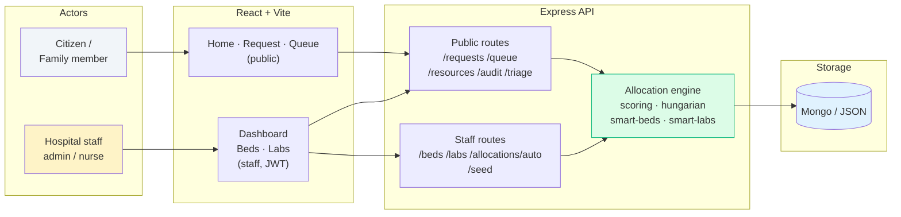

---

## 2. Patient intake — the happy path

A citizen submits a request, the Hungarian algorithm runs, and a bed is assigned before the form animation finishes.

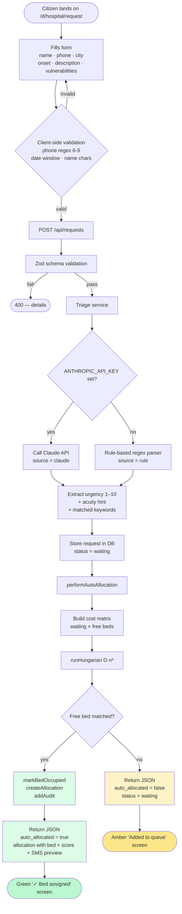

---

## 3. Patient intake — queue path

If no bed is free, the request waits. Each subsequent request or discharge re-runs Hungarian.

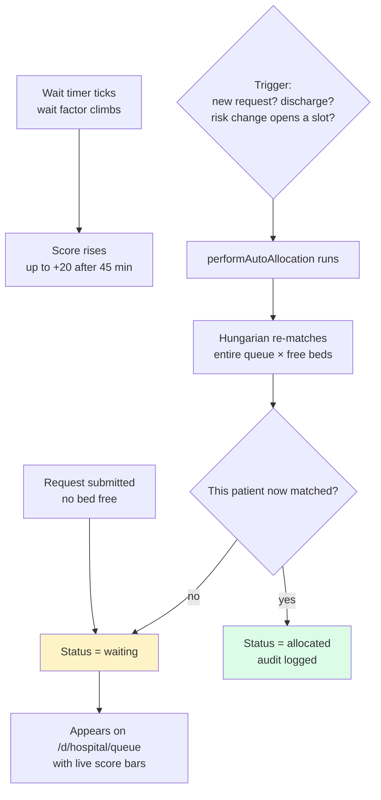

---

## 4. Staff admit — with bump

Staff opens the admit modal and the patient takes priority over the lowest-risk ICU occupant.

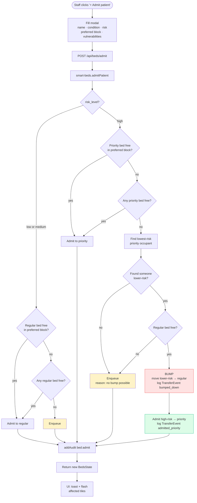

---

## 5. Risk change — promote / demote

Staff edits a patient's risk. The system maintains the priority-row invariant.

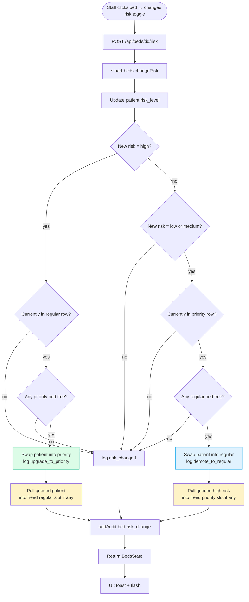

---

## 6. Discharge — pull-in from queue

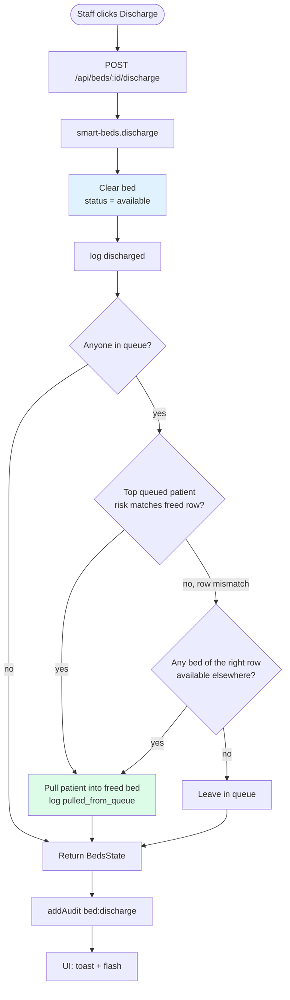

---

## 7. Lab emergency preemption

Lab is in-use, emergency toggled ON, new STAT test assigned → current occupant preempted.

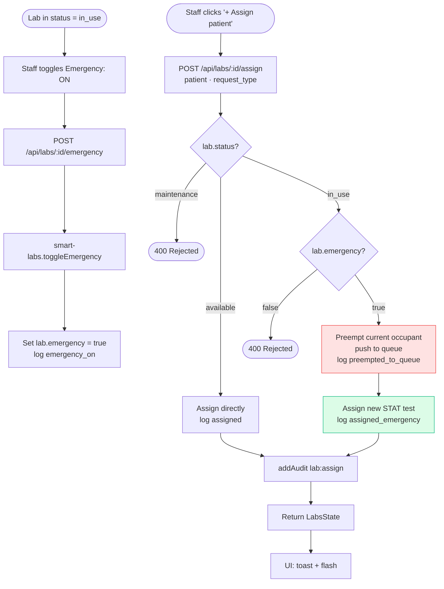

---

## 8. Lab maintenance toggle

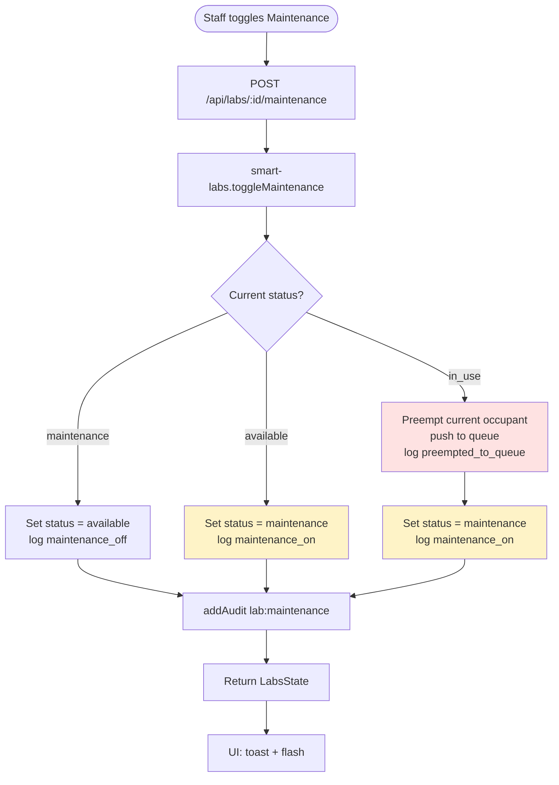

---

## 9. Authentication — staff login

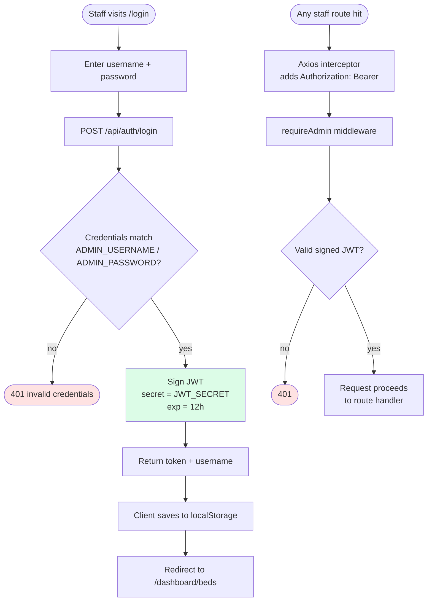

---

## 10. Real-time feedback loop

Every backend state change emits a `TransferEvent`. The UI turns it into a visible moment.

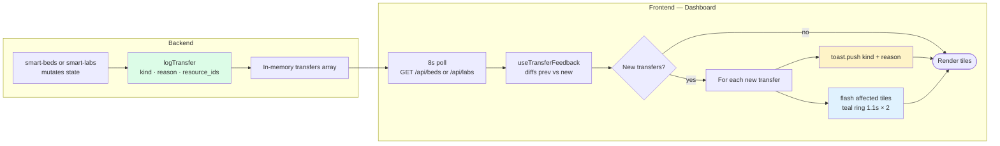

---

## 11. State machines

### Bed states

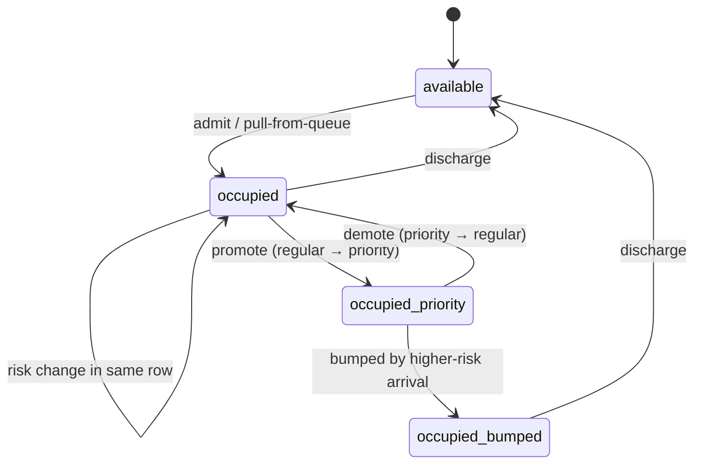

### Lab states

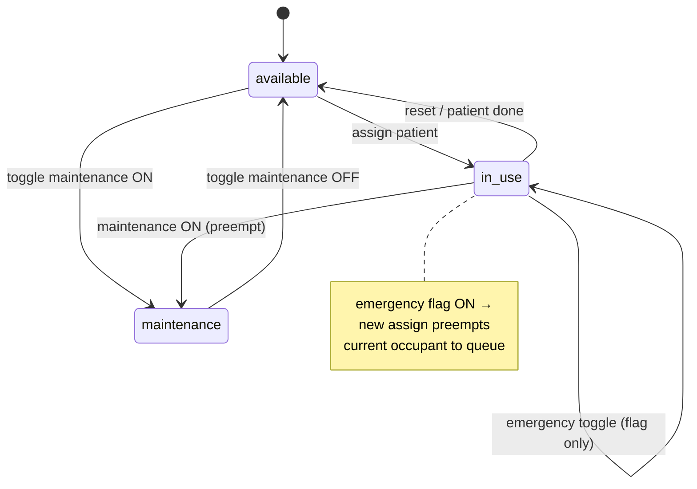

### Request lifecycle

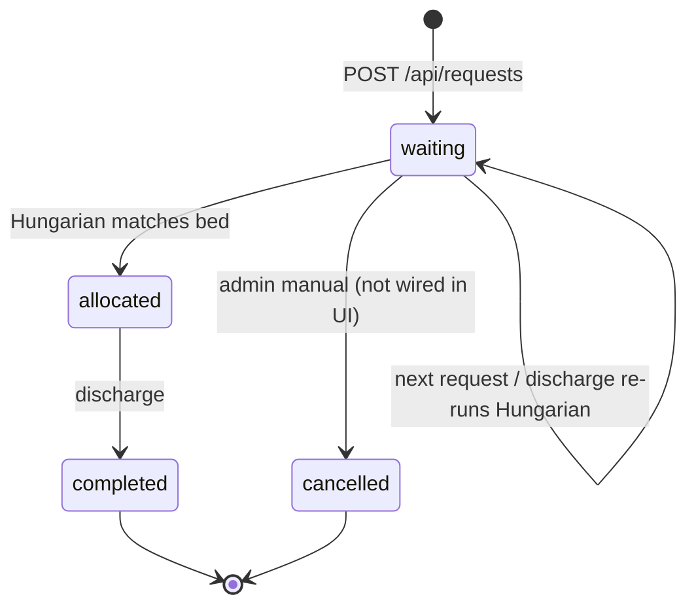

---

## How to read these diagrams

- **Rectangles** = synchronous actions (function calls, DB writes).
- **Diamonds** = decision points.
- **Rounded rectangles** = user-facing endpoints or results.
- **Cylinders** = data stores.
- **Dotted arrows** = optional / conditional paths.
- **Colour**: green = happy path, yellow = queue / maintenance, red = rejection or preemption, blue = storage / info.

For the narrated flow, see [`docs/demo-guide.md`](demo-guide.md). For the code references behind each node, see [`docs/architecture.md`](architecture.md).
