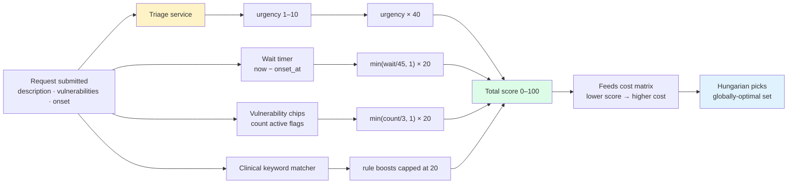

# Priority Scoring

The scoring layer is the face of our allocation engine — a transparent formula that a triage clerk, a doctor, and a jury member can all read in ten seconds.

> **Design principle:** no black box. Every component is a round-number weight. Every matched rule is rendered as a coloured bar on the UI. A patient can read *why* they got the score they got.

The formula feeds into the cost matrix that the Hungarian algorithm solves (`services/matching.ts`). See [`docs/architecture.md`](architecture.md) for how scoring, Hungarian, and smart reallocation fit together.

---

## The formula

```
score = urgency × 40 + wait × 20 + vulnerability × 20 + clinical rules × 20
```

All four components are normalized to **0..1**, so the maximum possible score is **100**. The four factors are rendered as coloured bars on every queue row — nothing is hidden.

Code: `api/src/services/scoring.ts`.

---

## What each factor means

### 1. Urgency (×40) — dominant weight

Extracted by the triage layer (`services/triage.ts`) from the request description:

- Rule-based fallback: regex match on symptom keywords (cardiac, chest pain, SpO2 < 85, "saans", stroke, labour, etc.)
- Optional Claude API layer: if `ANTHROPIC_API_KEY` is set, Claude extracts structured urgency.

Maps to 1–10, where:
- **1–3** → routine (e.g. follow-up, stable admit)
- **4–7** → urgent (fracture, dehydration, stable but needs care)
- **8–10** → critical (cardiac, severe respiratory, MI, stroke)

Contribution: `(urgency / 10) × 40`.

### 2. Wait (×20)

How long the patient has been waiting. A patient who's been in the queue 30 minutes gets a higher score than someone who just arrived with the same urgency — preventing starvation of moderate cases.

Contribution: `min(wait_minutes / 45, 1) × 20`. So after 45 minutes of waiting, the wait factor is fully saturated.

### 3. Vulnerability (×20)

Tap-to-toggle chips on the request form. Current flags:

- `senior_citizen` (60+)
- `pregnant`
- `disabled`
- `low_income` / BPL card
- `minor` (child under 13)

Contribution: `min(count / 3, 1) × 20`. Two or more vulnerability flags → fully saturated.

### 4. Clinical rules (×20)

Keyword-triggered boosts from the description. Current rules (hospital domain):
- *"chest pain"* · *"cardiac"* · *"heart"*
- *"SpO2"* low values
- *"stroke"* · *"weakness"* · *"unconscious"*
- *"labour"* · *"contractions"* · *"water broke"*
- *"saans"* / *"breathless"*

Each matched rule adds a fixed boost up to the 20-point cap.

---

## Four worked examples

### Example 1 — Ramesh, 68, chest pain, sweating

> "Dada ji chest pain, sweating, BP 160/100, diabetic"
> Flagged: senior_citizen

| Factor | Raw | Weighted |
|---|---|---|
| Urgency | 8/10 (critical, cardiac keyword) | 32 |
| Wait | 0 min | 0 |
| Vulnerability | 1 flag | ~7 |
| Rules | chest pain matched | 20 |
| **Total** | | **59** |

After 10 min wait → **63**. After 30 min → **72**.

### Example 2 — Priya, dengue, platelets 40k

> "Dengue, platelets dropped to 40k, fever 5 days"

| Factor | Raw | Weighted |
|---|---|---|
| Urgency | 7/10 (urgent) | 28 |
| Wait | 48 min (saturated) | 20 |
| Vulnerability | 0 | 0 |
| Rules | dengue keyword | 10 |
| **Total** | | **58** |

### Example 3 — Asha, breathing difficulty, SpO2 85%

> "Saans lene mein takleef, SpO2 85%, diabetic"
> Flagged: senior_citizen

| Factor | Raw | Weighted |
|---|---|---|
| Urgency | 10/10 (SpO2 < 85 auto-escalates) | 40 |
| Wait | 12 min | ~5 |
| Vulnerability | 1 flag | ~7 |
| Rules | breathless + saans | 20 |
| **Total** | | **72** |

Highest — Hungarian will match her to an ICU priority bed first.

### Example 4 — Mohammed, stable leg fracture

> "Road accident, leg fracture, stable, conscious"
> No vulnerabilities.

| Factor | Raw | Weighted |
|---|---|---|
| Urgency | 5/10 (urgent but stable) | 20 |
| Wait | 8 min | ~4 |
| Vulnerability | 0 | 0 |
| Rules | fracture matched | 10 |
| **Total** | | **34** |

Lowest of the four. Will get a regular bed, not priority.

---

## Hungarian vs the naive "just sort by score"

With these four patients, a naive first-come-first-served sort would place whoever arrived first into the first free bed. Hungarian instead:

1. Builds a **cost matrix** — every (patient, bed) pair has a cost based on:
   - Inverse of the priority score (higher score = lower cost)
   - Bed-type preference (ICU for critical, regular for routine, oxygen available, etc.)
   - Block preference (ICU for hospital domain rules)
2. Runs the **Jonker–Volgenant O(n³)** solver over the whole matrix.
3. Returns the globally-optimal assignment — the set of (patient → bed) pairs that minimizes total cost.

Result: Asha gets the first ICU. Ramesh gets the second. Priya gets a priority general bed. Mohammed gets a regular general bed. All decided in one pass.

Code: `services/matching.ts` and `services/hungarian.ts`.

---

## Tuning the weights

The weights are deliberately **round numbers** (40, 20, 20, 20) so they're easy to defend in a jury room. Change them in `services/scoring.ts`:

```ts
const W_URGENCY = 40;
const W_WAIT = 20;
const W_VULNERABILITY = 20;
const W_RULES = 20;
```

If you tune them, update this doc and re-run the worked examples so the pitch stays honest.

---

## Scoring pipeline



---

## Related docs

- [`docs/architecture.md`](architecture.md) — how scoring plugs into Hungarian and smart reallocation
- [`docs/flowcharts.md`](flowcharts.md) — the full request → score → allocate flowchart
